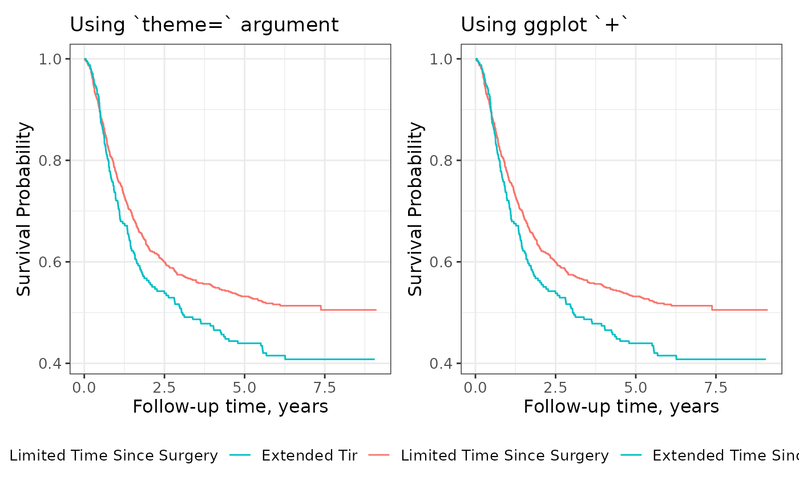
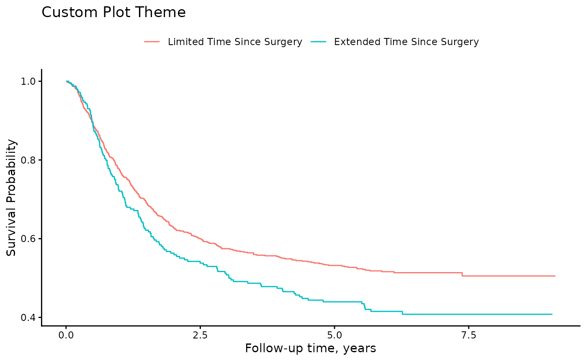
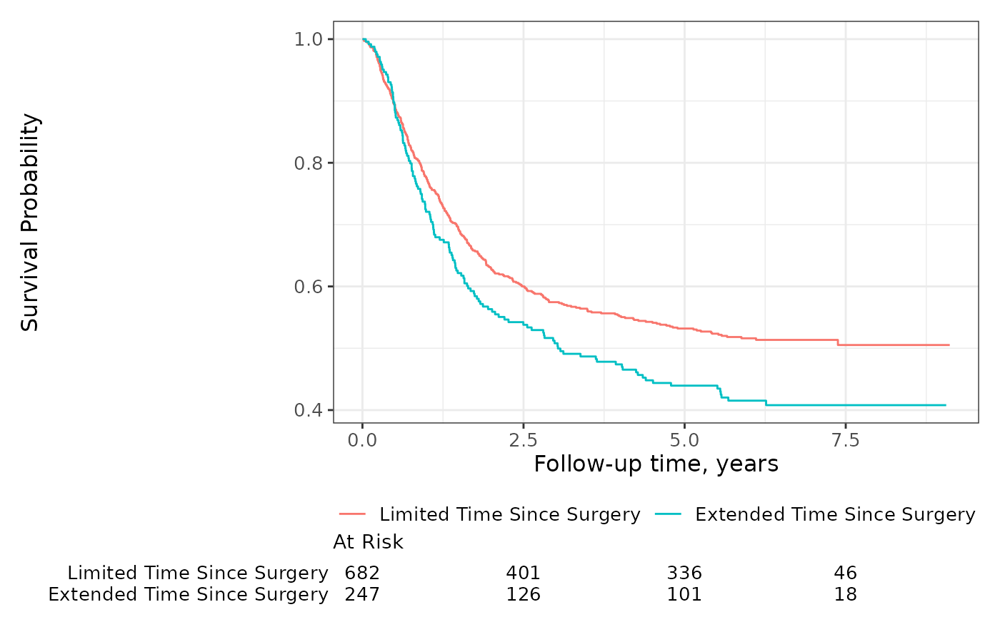
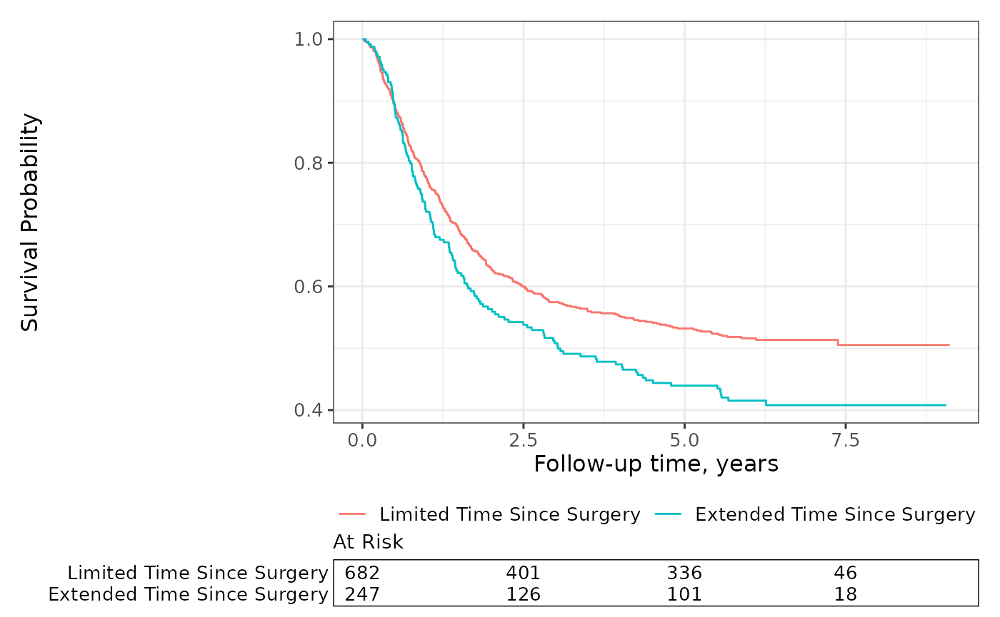
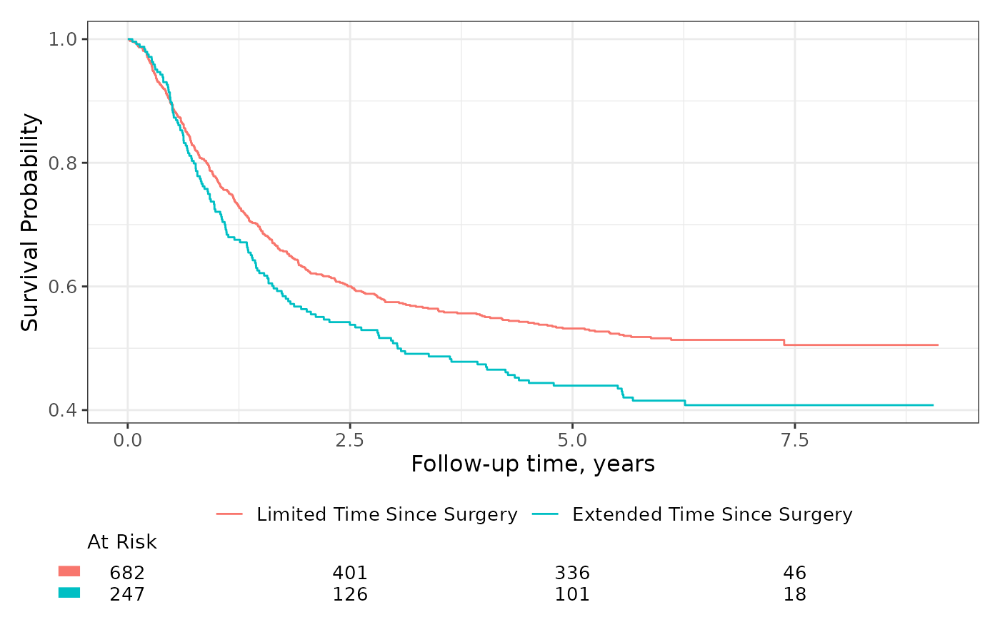

# Themes

### Plot Themes

Both
[`ggsurvfit()`](http://www.danieldsjoberg.com/ggsurvfit/reference/ggsurvfit.md)
and
[`ggcuminc()`](http://www.danieldsjoberg.com/ggsurvfit/reference/ggcuminc.md)
use
[`theme_ggsurvfit_default()`](http://www.danieldsjoberg.com/ggsurvfit/reference/theme_ggsurvfit.md)
as the default {ggplot2} theme, which is similar to
[`ggplot2::theme_bw()`](https://ggplot2.tidyverse.org/reference/ggtheme.html).
While this theme provides beautiful figures, you may want to modify it.

You can use the `ggsurvfit(theme=)` argument to change the default
theme. You can pass any {ggplot2} theme to this argument, or simply add
a theme using typical {ggplot2} syntax.

``` r
library(ggsurvfit)
#> Loading required package: ggplot2
library(patchwork)

gg_theme_default1 <- 
  survfit2(Surv(time, status) ~ surg, data = df_colon) %>%
  ggsurvfit(theme = theme_ggsurvfit_default()) +
  labs(title = "Using `theme=` argument")

gg_theme_default2 <- 
  survfit2(Surv(time, status) ~ surg, data = df_colon) %>%
  ggsurvfit(theme = NULL) +
  theme_ggsurvfit_default() +
  labs(title = "Using ggplot `+`")

gg_theme_default1 + gg_theme_default2
```



As you can see, either method of passing the theme results in an
identical figure. You can easily apply any user-created theme or any
theme that exported with the ggplot2 package. To construct a custom
theme, include ggplot2 calls in a list as in the example below.

``` r
survfit2(Surv(time, status) ~ surg, data = df_colon) %>%
  ggsurvfit(theme = list(theme_classic(), theme(legend.position = "top"))) +
  labs(title = "Custom Plot Theme")
```



### Risk Table Themes

Similar to the plots above, the risk tables also come with a default
theme. To understand how to use risk table themes, one must first
understand what a risk table is. Each risk table that is placed below a
plot is itself a ggplot created with
[`ggplot2::geom_text()`](https://ggplot2.tidyverse.org/reference/geom_text.html).

Unlike the plot themes, the risk table themes can only be passed via
`add_risktable(theme=)`.

``` r
survfit2(Surv(time, status) ~ surg, data = df_colon) %>%
  ggsurvfit() +
  add_risktable(
    risktable_stats = "n.risk",
    theme = theme_risktable_default()
  )
```



A typical theme appropriate for a risk table plot will remove grid lines
and provide a clean area to display the numbers at risk. In the risk
table above, the strata levels are y-axis labels, and “At Risk” is the
plot title.

Another risk table theme adds a box around the statistics presented.

``` r
survfit2(Surv(time, status) ~ surg, data = df_colon) %>%
  ggsurvfit() +
  add_risktable(
    risktable_stats = "n.risk",
    theme = theme_risktable_boxed()
  )
```



It’s possible to replace the stratum levels with a symbol, which is
particularly helpful when you have long group labels.

``` r
survfit2(Surv(time, status) ~ surg, data = df_colon) %>%
  ggsurvfit() +
  add_risktable(risktable_stats = "n.risk") +
  add_risktable_strata_symbol()
```



When customizing the risk table themes and using
[`add_risktable_strata_symbol()`](http://www.danieldsjoberg.com/ggsurvfit/reference/add_risktable_strata_symbol.md),
note that the symbol is added with
[`ggplot2::scale_y_discrete()`](https://ggplot2.tidyverse.org/reference/scale_discrete.html);
including a theme that uses the discrete y scale could cause a conflict.

If you need a risk table theme that is not currently available in
ggsurvfit, community-based themes are welcome! Consider adding your
theme to the package.
